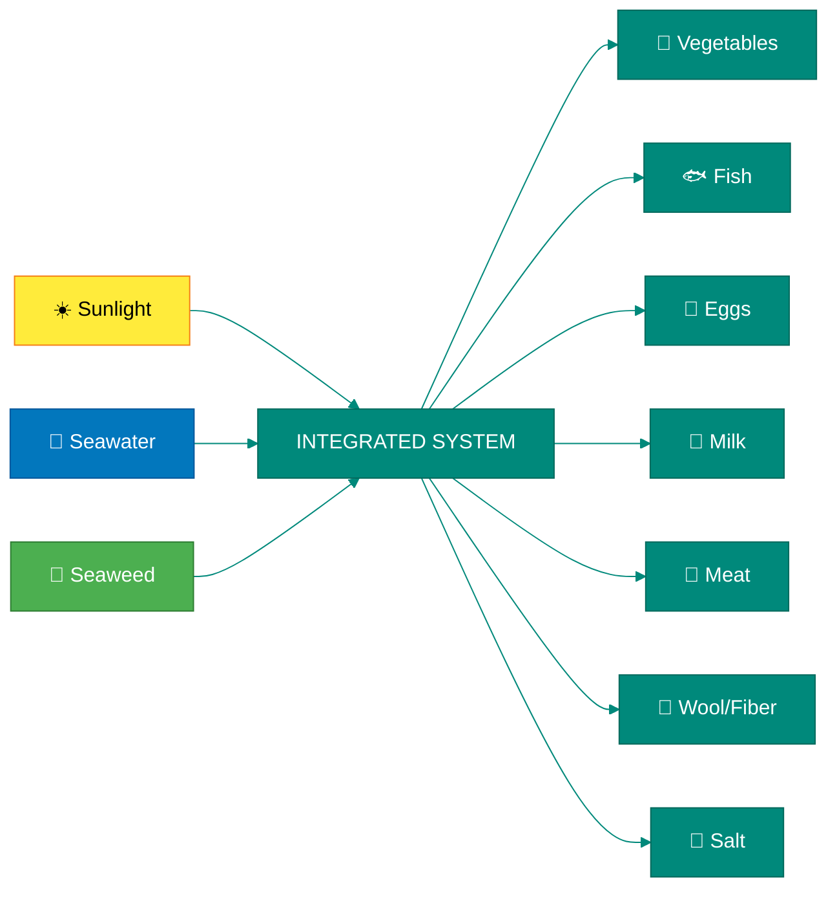
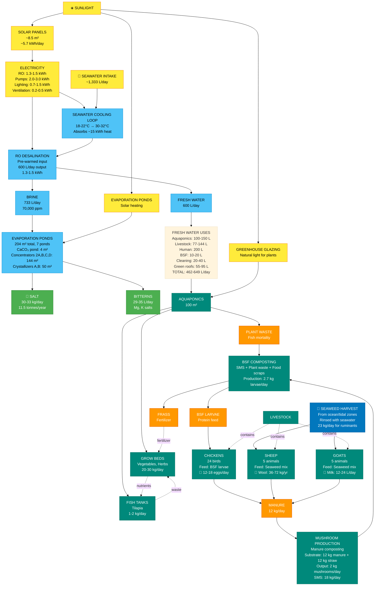
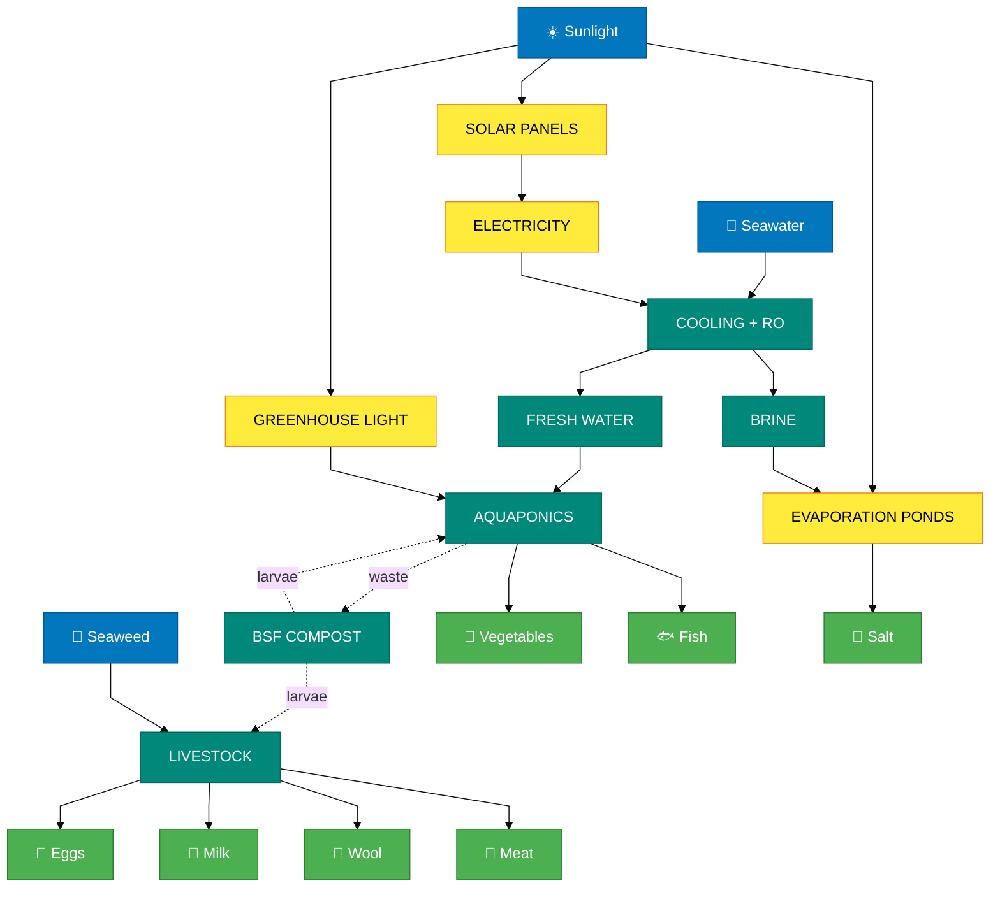
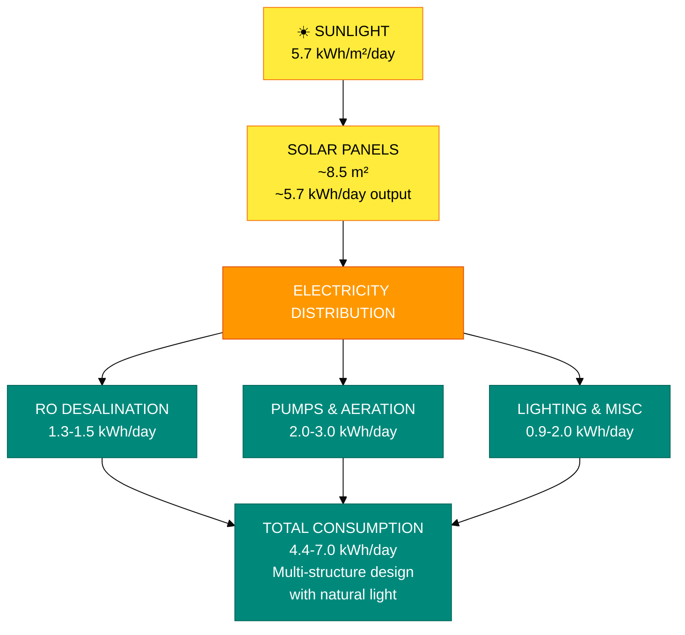
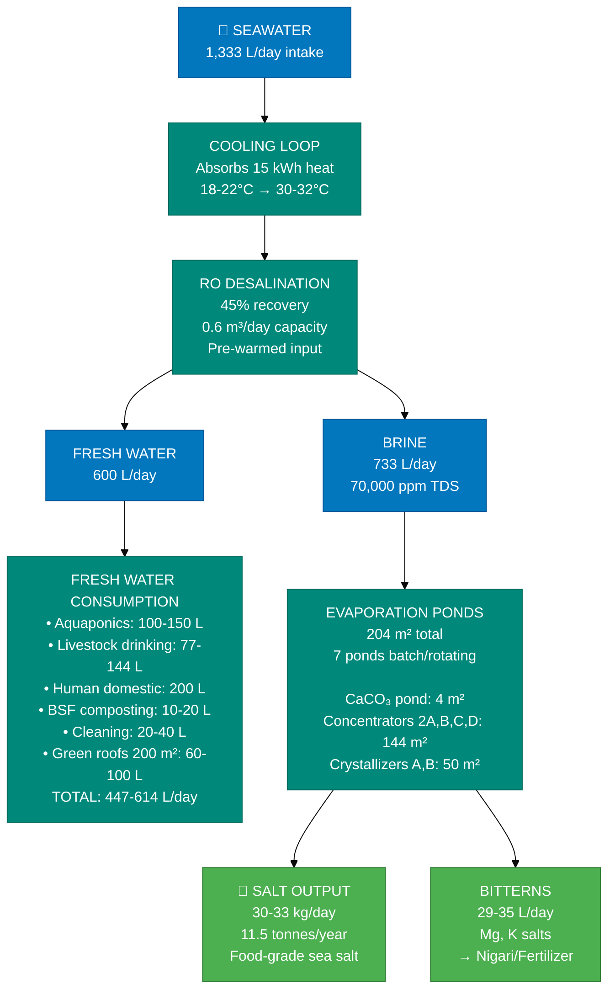
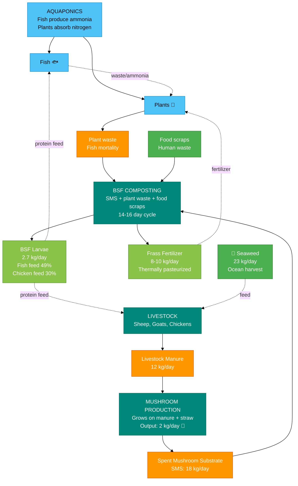
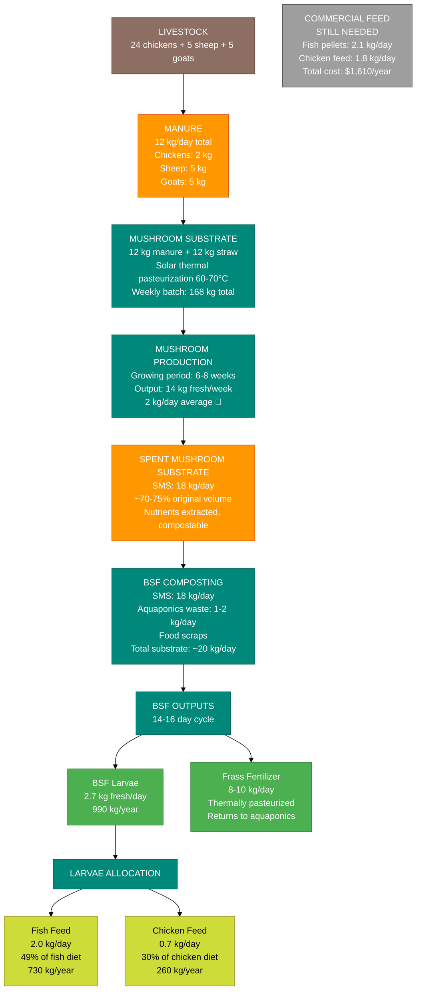

---
# AI-Generated Content Metadata
ai_generated: true
ai_assistant: "Claude AI (Anthropic)"
content_status: "hypothetical"
verification_status: "unverified"
implementation_status: "conceptual"
requires_expert_review: true
disclaimer: "AI-generated content. Professional verification required before implementation."
---

# Homestead System Flow Chart

**Date:** 2026-02-05 (Updated: 2026-02-06)
**Related Document:** [Homestead-Scale System](homestead-scale-system.md)

---

## System Overview

---

## Detailed System Flow

---

## Simplified Material Flow

---

## Energy Flow

---

## Water Flow

---

## Nutrient Cycling (Closed Loop)

---

## Scale-Up Path: Adding MED

```mermaid
%%{init: {'theme':'base'}}%%
graph TB
    subgraph HOMESTEAD["HOMESTEAD SCALE (Current)<br/>0.5 m³/day"]
        SW1[Seawater]
        COOL1[Cooling]
        RO1[RO Desalination]
        FW1[Fresh Water<br/>500 L/day]
        BR1[Brine<br/>733 L/day]
        POND1[Evaporation Ponds]
        SALT1[🧂 Salt<br/>30-33 kg/day]

        SW1 --> COOL1
        COOL1 --> RO1
        RO1 --> FW1
        RO1 --> BR1
        BR1 --> POND1
        POND1 --> SALT1
    end

    subgraph EXPANDED["EXPANDED SCALE (Future)<br/>>50 m³/day"]
        SW2[Seawater]
        COOL2[Cooling]
        RO2[RO Desalination]
        FW2A[Fresh Water<br/>Primary output]
        BR2[Brine]
        MED[MED System<br/>Multi-Effect Distillation]
        FW2B[Fresh Water<br/>Additional +70%]
        BR2C[Concentrated Brine<br/>70% less volume]
        POND2[Evaporation Ponds<br/>Smaller]
        SALT2[🧂 Salt]

        SW2 --> COOL2
        COOL2 --> RO2
        RO2 --> FW2A
        RO2 --> BR2
        BR2 --> MED
        MED --> FW2B
        MED --> BR2C
        BR2C --> POND2
        POND2 --> SALT2
    end

    classDef water fill:#0277bd,stroke:#01579b,color:#fff
    classDef process fill:#00897b,stroke:#00695c,color:#fff
    classDef output fill:#4caf50,stroke:#2e7d32,color:#fff

    class SW1,SW2,FW1,FW2A,FW2B,BR1,BR2,BR2C water
    class COOL1,COOL2,RO1,RO2,MED,POND1,POND2 process
    class SALT1,SALT2 output
```

---

## Complete Nutrient Pathway: Manure → Mushrooms → BSF

---

## Outputs Summary

| Output | Daily Yield | Annual Yield | Source |
|--------|-------------|--------------|--------|
| 🥬 Vegetables | 16-27 kg | 6.5-9.7 tonnes | Aquaponics |
| 🐟 Fish | 1-2 kg | 430-750 kg | Aquaponics |
| 🥚 Eggs | 12-18 | ~5,500 | Chickens (24) |
| 🥛 Milk | 5-10 L | 1,800-3,600 L | Goats (5, 2-3 lactating) |
| 🍖 Meat | ~0.3 kg | ~100 kg | All livestock |
| 🧶 Wool/Fiber | -- | 15-30 kg | Sheep (5) |
| 🧂 Salt | 30-33 kg | 10-12 tonnes (11.5 avg) | Brine evaporation |
| 🍄 Mushrooms | 2 kg | 730 kg | Manure substrate |

**Seaweed input:** ~23 kg fresh/day (~1 hour harvest) for 10 ruminants

---

## Key Points: Material Flow

1. **ALL manure goes to mushrooms first** (not directly to BSF)
2. **SMS from mushrooms becomes BSF substrate** (not manure)
3. **BSF production: 2.7 kg/day** from SMS + aquaponics waste
4. **Feed self-sufficiency: 42%** from BSF larvae
5. **Bonus output: 730 kg mushrooms/year** (14 kg/week)

### Why This Flow?

- **Mushrooms grow on fresh manure** (with straw as carbon source)
- **SMS is ideal for BSF** (still has organic matter, pre-composted)
- **Maximizes value extraction:** Manure → Mushrooms (human food) → BSF (animal protein) → Frass (fertilizer)
- **Eliminates double-counting:** Can't use same manure twice

---

**Status:** Interactive flowchart diagrams using Mermaid syntax. Updated 2026-02-07 to show 100 m² aquaponics greenhouse, 8.5 m² solar panels, 200 m² green roofs, and all metric units. System capacities: 0.6 m³/day RO, 4.4-7.0 kWh/day energy, 11.5 tonnes salt/year from 204 m² evaporation ponds (1 CaCO₃ pond 4m², 4 concentrator ponds 144m² batch/rotating, 2 crystallizer ponds 50m² batch/rotating).
